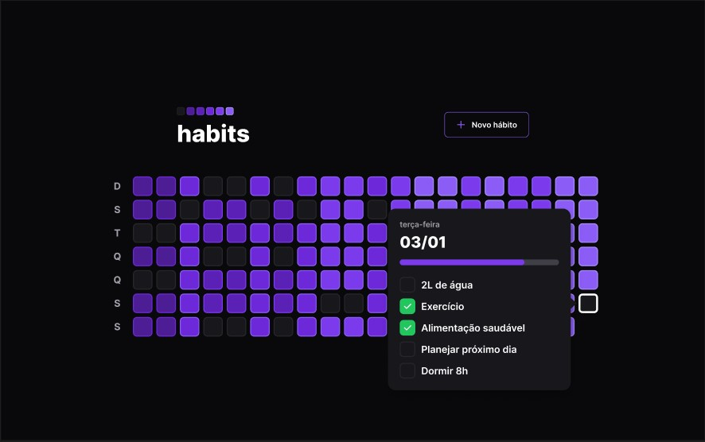
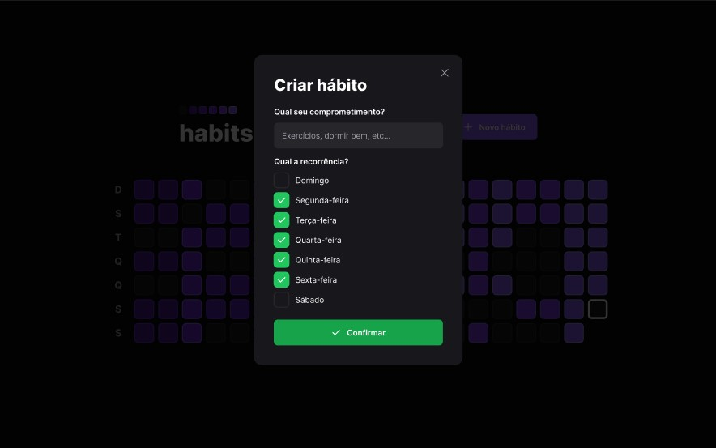

<h1 align="center">
    
</h1>

<br>

## Novo hábito

<h1 align="center">
    
</h1>

## ⚙️ Tecnologias

Este projeto foi desenvolvido utilizando:

- [Node.JS](https://nodejs.org/pt-br/)
- [Prisma](https://www.prisma.io/)
- [Fastify](https://www.fastify.io/)
- [ReactJS](https://reactjs.org/)
- [TypeScript](https://www.typescriptlang.org/)
- [DayJS](https://day.js.org/)
- [Phosphor Icon](https://phosphoricons.com/)
- [Radix UI](https://www.radix-ui.com/)
- [Tailwind CSS](https://tailwindcss.com/)

## 📌 Começando

Clone o projeto:

```bash
git clone https://github.com/gabrielcoutinh0/Habits-Ignite.git
cd Habits-Ignite
```

Instale as dependências :

```bash
cd frontend
npm install

cd server
npm install

# Rodar o backend
npm run dev

```

## 🖼️ Inspiração

- [Figma](<https://www.figma.com/file/ArxVYcX7q7OUgCwdfBV6b7/Habits-(i)-(Community)?node-id=6%3A343>)

Projeto desenvolvido na trilha Ignite na [Rocketseat](https://www.rocketseat.com.br/)
